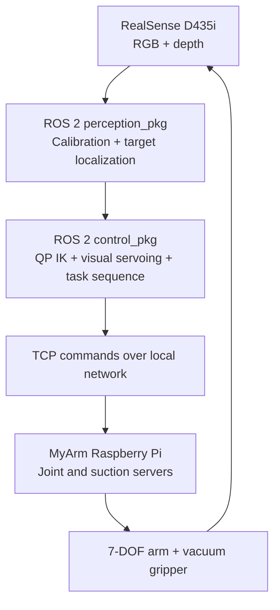

# Perception-Guided Robotic Manipulation

**A ROS 2 perception-and-control pipeline for autonomous pick-and-place using a 7-DOF robotic arm.**

**Project:** Perception-Guided Arm Control in Unstructured Scenes (University of Patras, June 2026)  
**Contributors:** Dimitrios Giannopoulos and Georgios Paspalakis  
**Hardware:** Elephant Robotics MyArm 300 Pi · Intel RealSense D435i · Raspberry Pi · suction-cup end effector

## Overview

This team project implements a camera-guided manipulation pipeline that recognizes **red target cubes** in cluttered tabletop scenes and attempts to relocate them using a vacuum gripper. The robot is controlled with ROS 2 on a host computer and lightweight TCP services running on the MyArm's embedded Raspberry Pi.

The key engineering components are:

- **3D perception:** RGB-D sensing, HSV-based target segmentation, depth filtering and top-face estimation.
- **Coordinate calibration:** ArUco-marker extrinsic calibration maps camera measurements into the robot base frame.
- **Motion computation:** Multistart quadratic-programming (QP) inverse kinematics with joint constraints, plus Jacobian/Newton–Raphson correction for local motion.
- **Closed-loop refinement:** Image-based XY error estimation and a visual-servoing correction before grasping.
- **Task execution:** A pick–lift–transport–release sequence with retry logic, suction actuation, and joint commands sent over TCP.

The accompanying [project report](docs/Project_Report.pdf) explains the mathematical formulation, design decisions, hardware integration and experimental observations. The report's student ID numbers have been redacted; contributor names remain intact.

## System architecture



The *perception* and *control* packages run in the host's ROS 2 workspace. The Raspberry Pi provides the physical robot and suction interfaces; the Pi and laptop need network connectivity.

## Repository layout

```text
.
├── project3-team3_workspace/
│   └── src/
│       ├── perception_pkg/     # Camera calibration, RGB-D estimation, visual feedback
│       └── control_pkg/        # QP IK, TCP command bridge, task automation
├── myarm_workspace/            # TCP services for the robot's Raspberry Pi
│   ├── joint_tcp_server.py
│   └── suction_tcp_server.py
├── suction_kit_base_stl/       # Custom 3D-printed gripper-mount geometry
├── docs/
│   └── Project_Report.pdf     # Team report (student IDs redacted)
├── scripts/
│   └── check_source.py        # Hardware-free syntax/layout validation
├── requirements-laptop.txt
└── INSTRUCTIONS.md            # Original project running notes
```

Generated `build/`, `install/`, `log/` and Python caches are intentionally not versioned.

## Requirements

**Hardware**: MyArm 300 Pi, D435i camera, compatible suction hardware, configured marker and work surface. Run mechanical/electrical safety checks before operating the physical system. The supplied relay design is project-specific and should not be treated as a certified reference design.

**Laptop**: a working ROS 2 installation (the original running notes mention Humble, Iron and Jazzy), `colcon`, ROS packages `rclpy`, `cv_bridge`, `realsense2_camera`, and the Python dependencies below. Package compatibility depends on your ROS and OS distribution.

```bash
python3 -m pip install -r requirements-laptop.txt
```

The MyArm Pi needs the manufacturer-supported Python robot interface (`pymycobot`) and GPIO support suitable for the board, as well as access to the joint and suction devices. Do not assume that desktop Python packages can be installed identically on the Pi.

## Running the supplied pipeline

These steps summarize the original [running instructions](INSTRUCTIONS.md). **They require real hardware and calibration and have not been executed in this documentation-only packaging pass.**

1. On the **robot Raspberry Pi**, start both supplied TCP services from `myarm_workspace/` in separate terminals:

   ```bash
   python3 joint_tcp_server.py
   python3 suction_tcp_server.py
   ```

2. On the **ROS 2 laptop**, build the workspace and source its setup script:

   ```bash
   cd project3-team3_workspace
   colcon build
   source install/setup.bash
   ```

3. Calibrate the camera extrinsics using a correctly placed ArUco marker:

   ```bash
   ros2 run perception_pkg aruco_extrinsic_calibrator
   ```

   The calibrator writes `~/.ros/myarm_camera_extrinsic.json`; this **local calibration** should not be committed.

4. Inspect the joint targets, reachable workspace, suction wiring, emergency stop, calibration accuracy, and network address before running automatic motion. Then run:

   ```bash
   ros2 run control_pkg task_automation_node
   ```

The supplied nodes default to `192.168.0.103` (Pi) and TCP ports `5017` (joint control) / `5018` (suction). These are **example local-network settings**, not discovery or authentication mechanisms. Restrict access to a trusted LAN. Some launch scripts are retained from development and contain example device-specific settings; the principal execution path is the one documented above.

## Implementation details

| Module | Relevant code |
|---|---|
| Camera-to-base extrinsic calibration | `perception_pkg/perception_pkg/aruco_extrinsic_calibrator.py` |
| RGB-D cube localization | `perception_pkg/perception_pkg/top_face_center_node.py` and `top_face_center_mask.py` |
| Visual-servoing measurements | `perception_pkg/perception_pkg/visual_servoing_perception_node.py` |
| QP and local IK | `control_pkg/control_pkg/qp_ik_solver.py`, `nr_ik.py` |
| End-to-end pick-and-place sequencing | `control_pkg/control_pkg/task_automation_node.py` |
| Physical joint/suction interface | `myarm_workspace/` |

These paths are relative to `project3-team3_workspace/src/` for the ROS packages.

## Results and limitations

The team report describes successful grasp-and-relocation demonstrations across different cube configurations. It reports **over 90% grasp success in favorable, well-separated scenes**, while also documenting reduced reliability under occlusion or tightly clustered/rotated targets. The report does not provide a standardized benchmark dataset or a complete trial count for that percentage; it should be interpreted as a project observation rather than an independently reproduced performance guarantee.

Several quantities (target color/size, tool offset, joint poses, calibration locations, timeouts and network settings) are tied to the original lab setup. The pipeline has not been ported or verified against a robot simulator for this GitHub packaging pass. **Do not execute automatic movement without hardware-specific review and safe operating procedures.**

## Verification

A lightweight hardware-free check can be run with:

```bash
python3 scripts/check_source.py
```

This verifies Python syntax, ROS 2 entry point declarations, package metadata XML readability, and required repository layout. It **does not** validate ROS dependencies, sensor streams, physical motion, real-time behavior, or grasp performance.

## Attribution and reuse

This was developed as a **two-person academic team project**, not a sole-authored work. Please retain both authors' names when referring to the project.

**License:** No open-source license is included at this stage; the contributors have not specified one. Public availability alone does not grant reuse or redistribution rights. Contact the contributors about licensing.

## Publishing to your own GitHub account

First create an **empty private repository** named `perception-guided-robotic-manipulation` under `GiorgosPaspa` on GitHub (without automatically generating a README, license or `.gitignore`). After extracting this archive into a local folder and ensuring Git is installed and authenticated, run:

```bash
bash scripts/publish_to_github.sh
```

The script asks for confirmation and then creates the first Git commit and pushes the files. Do not change the repo to public until both contributors have agreed to publication and licensing/ownership questions have been resolved.
