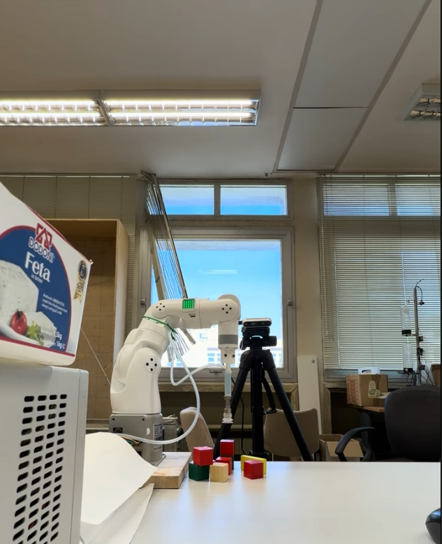

# Perception-Guided Robotic Manipulation

A ROS 2 project for detecting and moving objects with a 7-DOF **MyArm 300 Pi** robot and an **Intel RealSense D435i** camera.

**Georgios Paspalakis and Dimitrios Giannopoulos**  
University of Patras, 2026

[Demo video](https://www.youtube.com/shorts/BuSqtGto4cE) · [Project report](docs/Project_Report.pdf)

*Click the image to watch the demonstration.*

## Project

We built a system that detects red cubes on a table and moves them using a suction gripper. The ROS 2 software runs on a laptop, handling object detection, motion planning, and task execution. It communicates over TCP with two Python servers on the robot's Raspberry Pi, which control the arm joints and suction system.

## How it works

- **Camera-to-robot calibration — ArUco, PnP, rigid transformations:** The [calibration node](project3-team3_workspace/src/perception_pkg/perception_pkg/aruco_extrinsic_calibrator.py) estimates an ArUco marker's pose using OpenCV's IPPE square PnP solver and the camera intrinsics. Combining this estimate with the marker's known pose in the robot frame gives the camera-to-robot transformation. Estimates are averaged across frames, with the mean rotation projected back onto a valid rotation matrix using SVD.

- **Cube localization — HSV segmentation, RGB-D geometry, plane projection:** The [top-face detector](project3-team3_workspace/src/perception_pkg/perception_pkg/top_face_center_mask.py) combines HSV color thresholding, morphological opening/closing, and connected-component analysis. Aligned depth measurements are back-projected into 3D; a height histogram and median refinement estimate the local table level. The known cube size defines candidate top-face heights. Selected pixel rays are intersected with the top plane, and a minimum-area rectangle with the known edge length estimates the face corners and grasp center in robot coordinates.

- **Robot kinematics — screw axes, product of exponentials, Jacobians:** The arm model uses screw-axis coordinates and product-of-exponentials forward kinematics. Jacobian-based tasks control Cartesian position and the tool's approach axis, allowing rotation about that axis to remain unconstrained rather than prescribing a full wrist orientation.

- **Pre-grasp inverse kinematics — constrained quadratic programming, OSQP:** The [QP solver](project3-team3_workspace/src/control_pkg/control_pkg/qp_ik_solver.py) iteratively solves a regularized, weighted least-squares problem for joint velocities, balancing position and tool-axis errors subject to joint-position and velocity bounds. OSQP solves each quadratic program. Multiple initial configurations are sampled and ranked, with joint-limit margins and a limit-proximity penalty used to select a converged solution above the cube.

- **Visual alignment — 3D feedback, damped least-squares IK:** RGB-D detection of a blue end-effector marker gives the lateral offset from the cube center in robot coordinates. Corrections are averaged across frames and rejected when their variation exceeds a threshold. The [motion solver](project3-team3_workspace/src/control_pkg/control_pkg/move_xyz.py) converts the measured offset and descent into joint updates using a damped Jacobian pseudoinverse, an approximate null-space joint-centering term, joint-step limits, and joint-limit clipping while maintaining the tool-axis direction.

- **Task execution — ROS 2, TCP, grasp verification:** Perception and control run on the laptop; separate TCP servers on the Raspberry Pi execute joint and suction commands. The [task orchestrator](project3-team3_workspace/src/control_pkg/control_pkg/task_automation_node.py) sequences pre-grasp, alignment and descent, lifting, transport to a fixed drop pose, and release. It polls joint angles before release and uses a reduction in the detected cube count as a grasp-success check, with retries and skipping of unsuccessful targets.

## Repository structure

- `project3-team3_workspace/src/perception_pkg/` — camera calibration, cube detection and visual feedback
- `project3-team3_workspace/src/control_pkg/` — inverse kinematics, motion control and pick-and-place sequence
- `myarm_workspace/` — Raspberry Pi joint and suction servers
- `suction_kit_base_stl/` — 3D-printable suction mount
- `docs/Project_Report.pdf` — project report

Setup and execution instructions are available in [INSTRUCTIONS.md](INSTRUCTIONS.md).

This was a joint university project. The hardware setup has not been retested for this repository, and no reuse license has been assigned.
