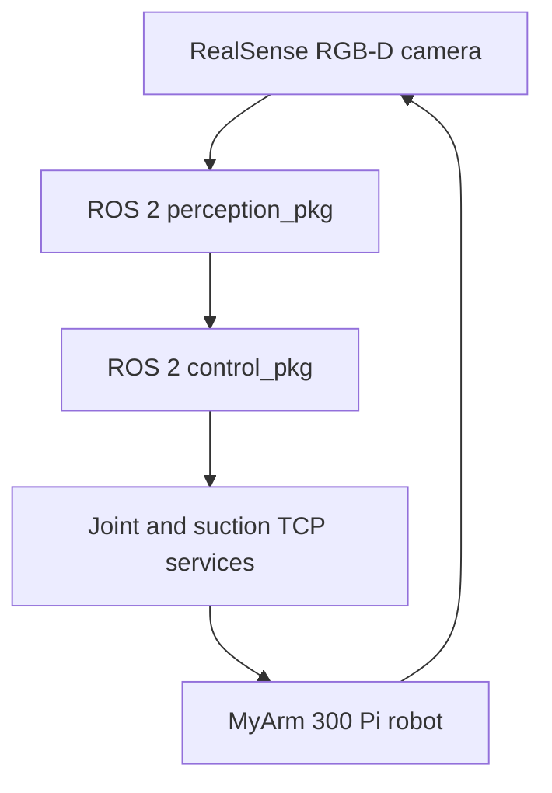

# Perception-Guided Robotic Manipulation

**ROS 2 perception and control for autonomous pick-and-place manipulation using a seven-degree-of-freedom robotic arm.**

**Academic project:** Perception-Guided Arm Control in Unstructured Scenes — University of Patras (June 2026)  
**Contributors:** Dimitrios Giannopoulos and Georgios Paspalakis  
**Hardware:** Elephant Robotics MyArm 300 Pi, Intel RealSense D435i RGB-D camera, Raspberry Pi, suction end effector

## Overview

This two-person project investigates camera-guided robotic manipulation. The implemented pipeline locates red cubes in tabletop scenes, transforms RGB-D detections to the robot's frame, computes motion using inverse kinematics, applies visual feedback, and performs pick–lift–transport–release sequences.

### Components

- **RGB-D perception:** HSV colour segmentation, depth processing, top-face estimation.
- **Extrinsic calibration:** ArUco markers to relate the camera and robot base frames.
- **Constrained motion:** multistart quadratic-programming inverse kinematics and local Jacobian/Newton–Raphson corrections.
- **Visual servoing:** camera-based position error estimation and corrective arm motion.
- **Hardware interface:** ROS 2 nodes on the laptop and lightweight TCP joint/suction services on the Raspberry Pi.

## Architecture



## Code layout

- `project3-team3_workspace/src/perception_pkg/`: camera calibration, cube localization, and visual-servoing measurements.
- `project3-team3_workspace/src/control_pkg/`: inverse kinematics, task automation, TCP command bridge, and motion control.
- `myarm_workspace/`: hardware-side joint and suction TCP services.
- `suction_kit_base_stl/`: gripper-mount geometry.
- `docs/`: project report and publication notes.
- `INSTRUCTIONS.md`: original running instructions.
- `scripts/check_source.py`: lightweight static checks.

Generated `build/`, `install/`, `log/`, bytecode, and other machine-local artifacts are intentionally excluded.

## Setup and operation

Requires an appropriate ROS 2 installation, `colcon`, RealSense ROS camera support, compatible Python dependencies, a calibrated ArUco setup, and the original MyArm hardware.

On the Raspberry Pi, run the joint and suction servers in separate terminals:

```bash
python3 joint_tcp_server.py
python3 suction_tcp_server.py
```

Build the workspace on the host machine:

```bash
cd project3-team3_workspace
colcon build
source install/setup.bash
```

Calibrate before motion:

```bash
ros2 run perception_pkg aruco_extrinsic_calibrator
```

Calibration is saved locally to `~/.ros/myarm_camera_extrinsic.json`; don't commit machine-specific calibration. After verifying robot reach, safe operating limits, network, and hardware, the original project uses:

```bash
ros2 run control_pkg task_automation_node
```

The original code includes example private-network settings: Raspberry Pi `192.168.0.103`, joint port `5017`, suction port `5018`. Adapt these to a trusted LAN before use.

**Safety:** No hardware operation was performed for this publication pass. Robot commands must not be run without device-specific inspection, emergency-stop readiness and safety procedures.

## Reported results and limitations

The original team report describes cube grasping and relocation demonstrations, reporting over 90% grasp success in favourable separated-object scenes while noting lower reliability with occlusion or close/rotated targets. No standardized public test set or complete trial-count breakdown accompanies that observation, so this is a reported project demonstration rather than an independently replicated benchmark.

The implementation assumes the original lab's target colour, camera positioning, kinematic parameters, and TCP layout. It has not been ported to a separate simulator in this preparation pass.

## Verification

```bash
python3 scripts/check_source.py
```

This hardware-free check covers Python parsing, package metadata, and selected project structure; it does **not** validate ROS dependencies, sensor data, robotic motion, or grasp performance.

## Contributors and licensing

This is a **joint academic project** by **Dimitrios Giannopoulos** and **Georgios Paspalakis**. Please credit both collaborators.

No open-source license is assigned at this stage. Public visibility does not by itself establish reuse rights, and publication/licensing should be agreed with both contributors.
